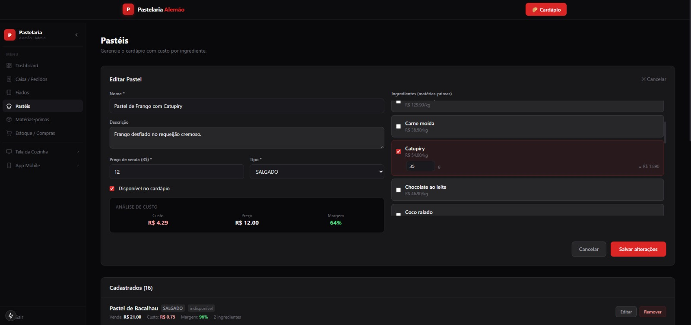
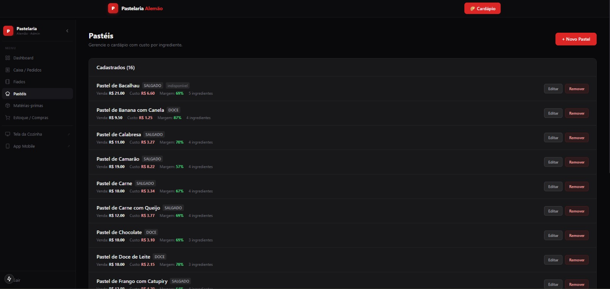
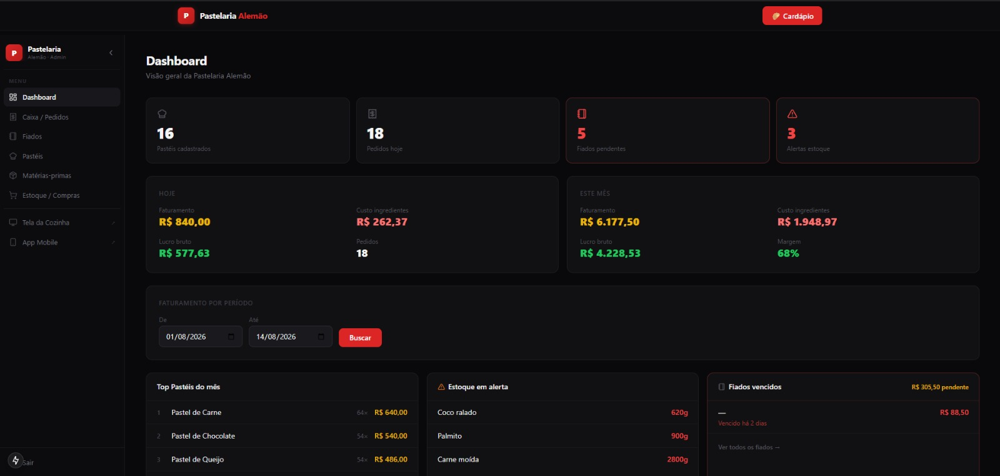
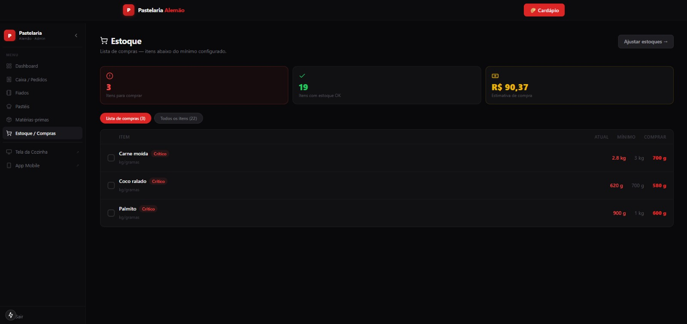
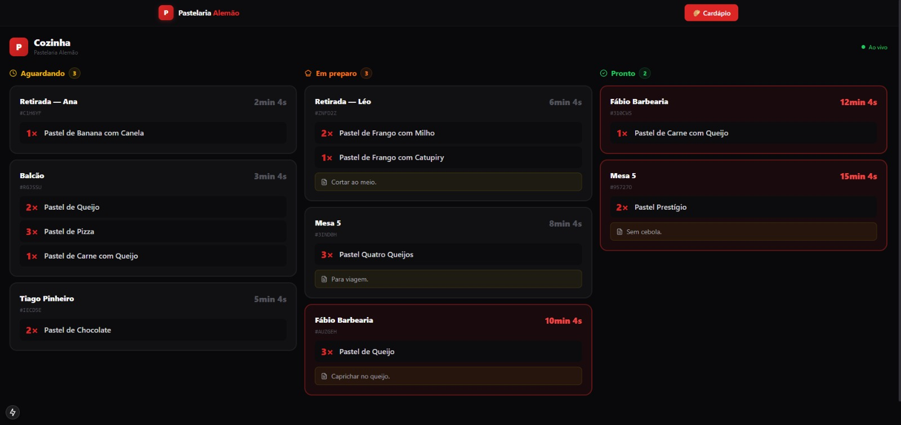
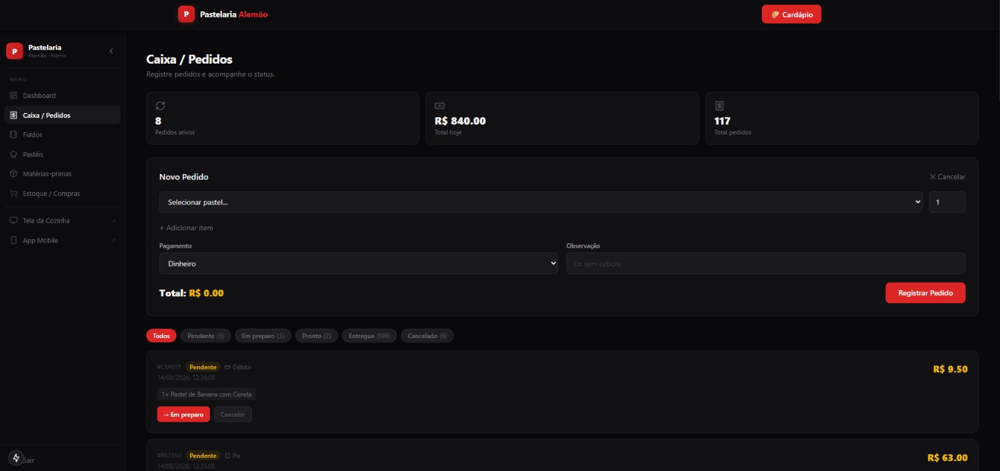
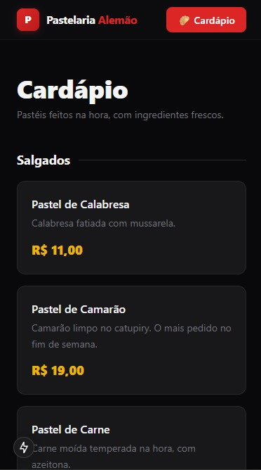
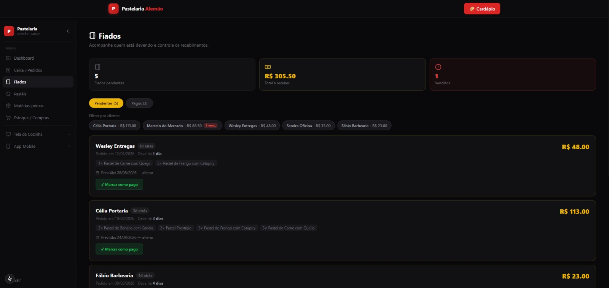

# Pastelaria Alemão

Sistema de gestão para uma pastelaria: cardápio público, painel do dono, tela de cozinha e
app do balcão. Monorepo TypeScript com **três aplicações** sobre uma única API e um único
banco.

O que separa isso de um CRUD de pedidos: **o sistema conhece a receita de cada pastel**. Cada
pastel é uma lista de matérias-primas com quantidade em gramas, e cada matéria-prima tem preço
por quilo. Dessa única ligação saem quatro coisas que um sistema de pedidos não dá:

- **custo e margem de cada pastel**, calculados — não chutados;
- **lucro real do dia e do mês**, porque o custo de cada pedido vem da receita;
- **lista de compras** com quanto comprar de cada item que furou o mínimo, **e quanto isso vai
  custar** antes de você sair de casa;
- **o estoque baixa sozinho** a cada pedido, na proporção da receita.

---

## O custo nasce no cadastro, não num relatório

<p align="center"></p>

Você monta o pastel marcando ingredientes e digitando os gramas. O preço por quilo aparece ao
lado de cada um, o custo daquela linha aparece na hora, e a **análise de custo** embaixo do
preço de venda mostra custo, preço e margem enquanto você digita.

É a diferença entre "acho que dá lucro" e **saber que o Frango com Catupiry custa R$ 4,29,
vende a R$ 12,00 e deixa 64%**. Quem define preço numa pastelaria decide isso de cabeça; aqui
a conta está na tela.

<p align="center"></p>

E na listagem cada pastel carrega venda, custo, margem e quantos ingredientes tem. Dá pra ver
de relance que o camarão deixa 57% e a banana com canela deixa 87% — o tipo de comparação que
muda decisão de cardápio.

## O painel responde a pergunta que o dono faz

<p align="center"></p>

Faturamento, **custo de ingredientes** e **lucro bruto** — do dia e do mês, com a margem. Mais
faturamento por período (com data de/até), os pastéis mais vendidos, o estoque em alerta e os
fiados vencidos, tudo na primeira tela.

## Lista de compras, não lista de estoque

<p align="center"></p>

A tela não pergunta "quanto tem no estoque". Ela responde **"o que eu preciso comprar, quanto,
e quanto vai custar"** — com checkbox pra ir marcando.

A quantidade sugerida é `(mínimo − atual) + 500 g` de folga, de propósito: comprar exatamente
o que falta te devolve ao mínimo, e no dia seguinte o item está crítico de novo. A estimativa
soma `quantidade × preço/kg` item por item.

> **No celular isso vale mais que no desktop.** Quem vai ao mercado leva a lista no bolso e vai
> dando baixa conforme coloca no carrinho — é o caso de uso que justifica o app existir, e não
> só ser um site responsivo.

## A cozinha, ao vivo

<p align="center"></p>

Três colunas por status, atualizando a cada 5 segundos. O card fica **vermelho ao passar de 10
minutos** — na imagem acima dá pra ver o de 10min já em alerta e o de 8min ainda normal.

Cada card traz quem pediu, os itens com quantidade e a observação ("cortar ao meio", "sem
cebola"), porque é isso que a pessoa na chapa precisa ler de longe.

## Caixa e cardápio

<p align="center">
  
  
</p>

No caixa, o pedido é montado e avança de status por botão. O cardápio é a parte pública, sem
login — a mesma API que alimenta o resto.

---

## As três aplicações

| App | Stack | Para quem |
|---|---|---|
| **web** | Next.js 15 · App Router · Tailwind v4 · Turbopack | cliente (cardápio) e dono (painel) |
| **api** | NestJS 11 · Swagger em `/docs` · class-validator | ninguém — é o cérebro |
| **mobile** | Expo SDK 54 · React Native 0.81 · Expo Router | balcão e cozinha, no celular |

Compartilham quatro pacotes: `db` (Prisma), `types`, `ui` e `tsconfig`. A regra de negócio
mora **só na API** — web e mobile são clientes dela, e nenhum dos dois fala com o banco.

```
Navegador / TV ──▶ Next.js 15 ──┐
                                 ├──▶ NestJS 11 ──▶ PostgreSQL (Neon)
Expo Go (Android/iOS) ──────────┘
```

---

## O que tem de interessante no código

### O alerta de estoque só dispara na travessia

O jeito ingênuo de avisar "acabou a farinha" é checar se o estoque está abaixo do mínimo
depois de cada pedido. O problema: uma vez abaixo, **todo pedido seguinte dispara o alerta de
novo**, e em meia hora o celular do dono virou spam e ele desligou a notificação.

Aqui o serviço tira uma foto do estoque **antes** e **depois** do decremento, e só notifica os
ingredientes que *cruzaram* o limiar naquele pedido — que estavam acima do mínimo e passaram
para baixo. Quem já estava crítico fica quieto.

```ts
const recemCriticos = depois.filter((d) => {
  const a = antes.find((x) => x.id === d.id);
  const eraOk        = a && Number(a.estoqueGramas) > Number(a.estoqueMinimo);
  const agoraCritico = Number(d.estoqueGramas) <= Number(d.estoqueMinimo);
  return eraOk && agoraCritico;
});
```

O alerta sai como **push nativo** (Expo Push) pros celulares que registraram token.

### Dinheiro não é `float`

Preço é `Decimal(10,2)` e quantidade de insumo é `Decimal(10,3)` no Postgres. Somar centavos
em ponto flutuante acumula erro, e num sistema que fecha caixa isso aparece.

### Fiado como fluxo de primeira classe

`FIADO` é um método de pagamento junto de PIX e cartão, e não uma gambiarra em cima de
"observação". O pedido guarda previsão de pagamento, se já foi pago e quando — e existe uma
tela do dono pra cobrar e uma tela do cliente pra ver o que ele deve. É a forma como pastelaria
de bairro funciona de verdade.

<p align="center"></p>

A tela agrupa por devedor, marca **vencido** e **vence em N dias**, e recebe com um clique. O
total a receber e a contagem de vencidos ficam no topo — e também no painel principal, porque
fiado esquecido é prejuízo silencioso.

### Duas conexões de banco, de propósito

`DATABASE_URL` aponta pro pooler (PgBouncer) e é o que a aplicação usa em runtime;
`DIRECT_URL` é conexão direta e existe porque **migração de Prisma não funciona através de
pooler**. É uma pegadinha que só aparece quando o deploy quebra.

### Custo e margem no dashboard

`/admin` mostra pedidos, faturamento, custo e lucro do dia e do mês, os cinco pasteis mais
vendidos, a distribuição de pedidos por status e a lista de ingredientes em estoque crítico.
O custo vem da receita, ingrediente por ingrediente.

### Quanto custa repor o que faltou

A lista de compras não sugere o déficit puro. Ela soma uma folga — 500 g, ou 2 unidades para
item contado — porque comprar exatamente o que falta te deixa **em cima** do mínimo, e o item
volta a ficar crítico no dia seguinte:

```ts
const faltam = critico
  ? Math.max(0, minimo - atual) + (mp.unidade === "UNIDADE" ? 2 : 500)
  : 0;
```

A estimativa de compra é a soma de `faltam × preço/kg` de cada item crítico. É o número que o
dono quer antes de ir ao mercado, e ele não existe em nenhuma tela de "estoque" comum.

---

## Domínio

```
MateriaPrima ──< PastelIngrediente >── Pastel ──< ItemPedido >── Pedido ──> Cliente
  (preço/kg,        (gramas)            (preço)    (qtd, preço      (status,
   estoque,                                          na hora)       pagamento,
   mínimo)                                                          fiado)
```

`ItemPedido` guarda `precoUnit` no momento da venda: mudar o preço do pastel amanhã **não
reescreve o histórico** de faturamento.

Ciclo do pedido: `PENDENTE → EM_PREPARO → PRONTO → ENTREGUE` (ou `CANCELADO`, que sai de
todos os cálculos).

---

## Rodando

Precisa de Node ≥ 20, pnpm ≥ 9 e um PostgreSQL (o projeto usa [Neon](https://neon.tech)).

```bash
pnpm install

cp .env.example .env                # preencher DATABASE_URL e DIRECT_URL
cp .env .env.api && mv .env.api apps/api/.env    # a API lê o dela

pnpm db:generate                    # gera o Prisma Client
pnpm db:migrate                     # cria as tabelas
pnpm db:seed                        # dados de demonstração

pnpm dev                            # web :3000 + api :3001
```

> São dois arquivos porque o alvo é diferente: as ferramentas de banco (Prisma, seed) leem o
> `.env` da **raiz**, e o NestJS lê o de `apps/api/`. Os valores são os mesmos.

O seed popula **um mês de operação**: 22 matérias-primas com receita ligada a cada um dos 16
pastéis, mais de 100 pedidos espalhados pelas semanas (sexta e sábado vendem mais, domingo
menos), oito pedidos na fila da cozinha agora mesmo, fiados em aberto — um deles vencido — e
três ingredientes abaixo do mínimo, pro painel ter o que alertar. A semente do gerador é fixa,
então rodar duas vezes dá o mesmo resultado.

> ⚠️ O seed **apaga** os dados de negócio antes de popular. É para banco de desenvolvimento.

Individualmente:

```bash
pnpm --filter @pastelaria/web dev      # Next.js  → localhost:3000
pnpm --filter @pastelaria/api dev      # NestJS   → localhost:3001  (docs em /docs)
pnpm --filter @pastelaria/mobile dev   # Expo     → QR code no Expo Go
```

> No celular físico, `localhost` não resolve. Ajuste a URL da API em
> `apps/mobile/src/lib/api.ts` pro IP da máquina na rede local.

### Rotas

| Rota | Quem usa |
|---|---|
| `/` · `/cardapio` | cliente — landing e cardápio |
| `/cozinha` | cozinha — fila de produção, atualiza a cada 5s |
| `/admin` | dono — faturamento, custo, lucro, alertas |
| `/admin/pedidos` · `/pasteis` · `/materias-primas` · `/estoque` · `/fiados` | dono |
| `/login` | admin |

---

## Limitações conhecidas

Estão aqui porque são decisões, não descuidos — e porque um sistema desse tamanho não precisa
resolver problema que não tem.

- **Autenticação é mínima.** A API compara usuário e senha contra variável de ambiente e não
  emite token; os endpoints não têm guard. Funciona porque o painel roda na rede da loja, mas
  não é o que eu escreveria pra uma API exposta. O caminho é JWT com guard por rota.
- **A criação de pedido não é transacional.** O pedido é criado e depois os insumos são
  decrementados. Se o processo morrer no meio, o estoque fica adiantado. `prisma.$transaction`
  resolve.
- **O dashboard carrega o mês inteiro na memória** pra somar custo, porque o custo depende da
  receita de cada item. Para uma pastelaria são centenas de linhas por mês e é irrelevante;
  em outra escala isso vira agregação no banco.

---

## Stack

TypeScript · Turborepo · pnpm workspaces · NestJS 11 · Next.js 15 · React Native / Expo 54 ·
Prisma · PostgreSQL (Neon) · TailwindCSS v4 · Swagger/OpenAPI · Expo Push Notifications ·
deploy: web na **Vercel**, API no **Railway**, banco no **Neon**
